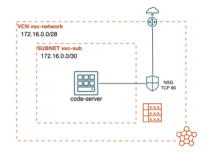

# Code-Server on Oracle Cloud Infrastructure 

 

## Deploy Code-Server on OCI VM 

One-click button deploy to deploy [code-server](https://github.com/cdr/code-server) on Oracle Cloud Infrastructure compute instance.

## Introduction
This project enables you to create and configure network and compute resources on OCI and launch a code-server instance.

## Architecture Diagram

### Prerequisites
- Oracle Cloud account

## URLs
For more information about `code-server`: 
* [code-server](https://github.com/coder/code-server)
* [deploy-code-server](https://github.com/coder/deploy-code-server)

## Contributing
This project is open source.  Please submit your contributions by forking this repository and submitting a pull request!  Oracle appreciates any contributions that are made by the open source community.

## License
Copyright (c) 2021 Oracle and/or its affiliates.

Licensed under the Universal Permissive License (UPL), Version 1.0.

See [LICENSE](LICENSE) for more details.
